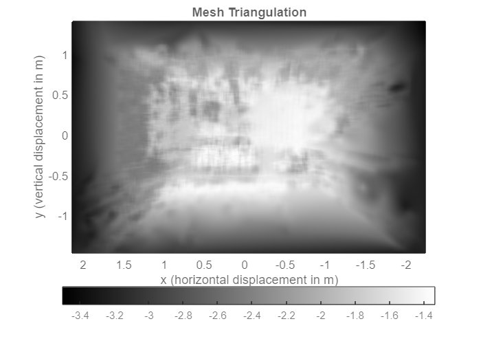

# `matlab-trimesh-stereo-reconstruction`

MATLAB Computer Vision Toolbox script for stereo reconstruction as a tesselating 3D triangular mesh surface in STL format.

This script is unique, because it implements userland logic for:
- normalising a binocular disparity data map by combining multiple match methods
- model-filtering the scene limits of the generated point cloud
- post-processing the scene point cloud with an interpolating signal filter
- normalising the Cartesian (X-Y-Z) output axes in the resulting STL

**Dependency tree:**
- [`$matlabroot/toolbox/vision`](https://uk.mathworks.com/help/vision/)
- [`surf2stl`](https://mathworks.com/matlabcentral/fileexchange/4512)

> Install the [**`mpm`**](https://mathworks.com/matlabcentral/fileexchange/54548) addon to manage File Exchange or GitHub dependencies automatically.

**File tree:**
- `./script.m`: a command window script
- `./app.m`: a GUI script
- `./live.mlx`: a live script
- Image folders - `./data/*`:
  - `/input`: actual 3D modelling target scene
  - `/config/left`: left stereo view with checkerboard
  - `/config/right`: right stereo view with checkerboard
- Documentation - `./assets`
- Output - `./point-cloud.stl` (checked out)

----

## Configuration

### Setup

**Input:** collect grayscale stereo photos in landscape using the `*.jpg` / `*.jpeg` format (can use any [`imformats`](https://uk.mathworks.com/help/matlab/ref/imformats.html) extension).
 - Add checkerboard images from left stereo view to `./config/left`.
 - Add checkerboard images from right stereo view to `./config/right`.
 - Add modelling input images from stereo view to `./config`.

**Output:** A 3D representation of the `./input` stereo image set in STL format. The default location is `./point-cloud.stl`.

**N.B:** For good performance:
- resize your images below 720p (maybe between 360p and 480p)
- use [GIMP](https://www.gimp.org/) and [BIMP](https://alessandrofrancesconi.it/projects/bimp/) to convert the image color space to grayscale

### Image support

- Must be the same orientation as the checkerboard to reduce pixel
   error from reprojection.
- For calibration images:
  - asymmetric (odd-even) checkerboard should be in all views
  - minimum image count per folder is 4 (for low reprojection error)
  - naming convention: `./config/<VIEW>/<VIEW>##.jpg`
    (e.g. `./config/left/left01.jpg`)

```matlab
imformats() % supported images formats in MATLAB
```

**N.B:** the image file names must be numbered in ascending order.<br>

----

## Source code

### Setup

#### Environment cleanup

```matlab
close all;
clear;
clc;
```

#### Workspace cleanup

```matlab
filePath = fullfile(pwd, 'data', 'toolbox');
stlPath = 'point-cloud.stl';
if exist(fullfile(filePath, stlPath), 'file')
    recycle on;
    delete(fullfile(filePath, stlPath));
end
```

### Input loading

```matlab
inputImages = imageDatastore(fullfile(filePath, 'input'));
I1 = readimage(inputImages, 1);
if size(I1, 3) == 3
    I1 = rgb2gray(I1);
end
I2 = readimage(inputImages, 2);
if size(I2, 3) == 3
    I2 = rgb2gray(I2);
end
```

### Dependency management

```matlab
if ~exist("surf2stl", "file")
    if ~matlab.addons.isAddonEnabled("mpm")
        error([                                                         ...
            "Please install MPM as a MATLAB Addon.\n"                   ...
            "<a href="""                                                ...
            "https://mathworks.com/matlabcentral/fileexchange/54548"    ...
            """>"                                                       ...
            "mpm - File Exchange - MATLAB Central"                      ...
            "</a>"                                                      ...
        ])
    else
        mpm install surf2stl;
    end
end
```

### User configuration

**Variables:**

- `imageMinimum`: Minimum number of images in calib folder.
- `squareWidthMm`: Checkerboard square width in mm.
- `ptCloudDensity`: Point density within squareWidthMm.
- `sGolayFiltOrder`: Savitsky-Golay extrapolation curve order.
- `sGolayFiltFrameLen`: Savitsky-Golay sliding window point count.
- `disparitySGBias`: Algorithm bias to semi-global matching vs block matching (in the range -1 to 1).
- `disparityMaxRatio`: Ratio for disparity map ceiling vs maximum disparity (in the range 0 to 1).

```matlab
squareWidth = 50;
ptCloudDensity = 5;
sGolayFiltOrder = 3;
sGolayFiltFrameLen = 21;
disparityBMBias = -0.5;
disparityMaxRatio = 0.675;
```

#### Show loading indicator

Script takes $T = ~30s$ to execute.

```matlab
wb = waitbar(0, 'Loading');
wb.Visible = 'on';
```

----

### Camera calibration of stereo images

Code based on MATLAB `rectifyStereoImages` code sample. [\[1\]][mathworks-help-rectifystereoimages]

#### Image loading

Using a grayscale color space reduces image data & overhead in calibration phase. [\[2\]][mathworks-help-rgb2gray].

**See:** ["Image support"](#image-support).

```matlab
waitbar(0, wb, 'Loading input images.');
calibLeftImages = imageDatastore(fullfile(filePath, 'config', 'left'));
calibRightImages = imageDatastore(fullfile(filePath, 'config', 'right'));
```

#### Image validation

**Errors:**
- `char` - mismatch in image count between `./config/left` & `./config/right`.
- `char` - below 4 images in `./config/left` & `./config/right`.
- `char` - mismatch in resolution of `./input` images.

```matlab
S1 = [size(I1, 1), size(I1, 2)];
S2 = [size(I2, 1), size(I2, 2)];

imageAmounts = struct;
imageAmounts.L = size(calibLeftImages.Files, 1);
imageAmounts.R = size(calibRightImages.Files, 1);

errno{1} = 'stereo2trimesh::ERR_MISMATCH_IMG_COUNT';
errno{2} = 'stereo2trimesh::ERR_CALIB_IMG_INSUFFICIENT';
errno{3} = 'stereo2trimesh::ERR_MISMATCH_IMG_DIM';

if imageAmounts.L ~= imageAmounts.R
    e = [errno{1} ' (L: ' imageAmounts.L ', R: ' imageAmounts.R];
    errordlg(e);
    error(e);
elseif imageAmounts.L < 4
    e = [errno{2} ' (n=' imageAmounts.L ')'];
    errordlg(e);
    error(e);
elseif ~isequal(S1, S2)
    e = [errno{3} ' (L: ' S1(1) 'x' S1(2) 'px, R: ' S2(1) 'x' S2(2) 'px)'];
    errordlg(e);
    error(e);
end
```

#### Checkerboard detection

```matlab
waitbar(0.1, wb, 'Detecting checkerboard keypoints.');
[imagePoints, boardSize] = detectCheckerboardPoints(                    ...
    calibLeftImages.Files,                                              ...
    calibRightImages.Files                                              ...
);
```

#### Calculate undistorted checkerboard keypoints

```matlab
worldPoints = generateCheckerboardPoints(boardSize, squareWidth);
```

#### Calibrate stereo camera system

**Parameters:**
- `EstimateSkew`: Are image axes exactly perpendicular? Default: `true`.
- `EstimateTangentialDistortion` Factor in whether the camera is horizontal. Default: `true`.
- `NumRadialDistortionCoefficients`: Good for fish-eye lenses. Default: `2`.
- `ImageSize`: Matrix for size of image - `imageSize`.
**TODO:** Adjust `estimateCameraParameters` parameters for experimental stage.

```matlab
waitbar(0.2, wb, "Estimating camera parameters.");
[stereoParams, ~, estimationErrors] = estimateCameraParameters(         ...
    imagePoints, worldPoints,                                           ...
    'EstimateSkew', true,                                               ...
    'EstimateTangentialDistortion', false                               ...
);
```

#### Display camera extrinisics

**Figure 1:** Checkerboard boundary points for calibration experiment.

Reprojection is process of "reprojecting" original image from a camera image.

Most camera images have distortion (e.g. "fisheye" lens effect).

```matlab
waitbar(0.3, wb, "Showing camera extrinisics.");
figure;
showExtrinsics(stereoParams, "CameraCentric");
view([-45 45]);
```


#### Graph camera reprojection errors

**Figure 1:** Reprojection errors for calibration experiment.

```matlab
waitbar(0.4, wb, "Showing reprojection errors.");
figure;
showReprojectionErrors(stereoParams);
```
> 

```matlab
displayErrors(estimationErrors, stereoParams);
```


#### Stereo rectification with "valid" output view

The "valid" option is most suitable for computing disparity of rectified images. These images have negative polar distortion and appear concave (the top has a U-curve). It limits the rectified image data from to a regular 2D rectangle. [\[3\]][mathworks-help-rectifystereoimages]

**Parameters:**
- `OutputView`: Crops the image to a rectangle, fitting inside the overlapping, curved 3D anaglyph. Default: `valid`.

```matlab
waitbar(0.5, wb, "Showing stereo rectification.");
[F1, F2] = rectifyStereoImages(I1, I2, stereoParams, 'OutputView', 'valid');
pixelDensityMm = mrdivide(                                              ...
    mean([                                                              ...
        stereoParams.CameraParameters1.FocalLength,                     ...
        stereoParams.CameraParameters2.FocalLength                      ...
    ], 2),                                                              ...
    mean([                                                              ...
        stereoParams.CameraParameters1.IntrinsicMatrix(1, 1),           ...
        stereoParams.CameraParameters2.IntrinsicMatrix(1, 1)            ...
    ], 2)                                                               ...
);
approxImageHeight = 2 * mean([size(F1, 1), size(F2, 1)], 2) / pixelDensityMm;
approxImageWidth = 2 * sqrt(2) * mean([size(F1, 2), size(F2, 2)], 2) / pixelDensityMm;
```

#### Display an "valid" output anaglyph image

**Figure 3:** stereo anaglyph image of input scene.

```matlab
waitbar(0.6, wb, "Showing stereo anaglyph.");
figure;
hold on;
labels{1} = plot(nan, nan, 'color', 'red');
labels{2} = plot(nan, nan, 'color', 'black');
labels{3} = plot(nan, nan, 'color', 'cyan');
legend([labels{:}], {'left', '', 'right'});
imshow(stereoAnaglyph(F1, F2));
axis tight;
title 'Rectified Image';
clearvars labels;
```


----

### Disparity computation from stereo images.

Code based on MATLAB `disparitySGM` code sample. [\[4\]][mathworks-help-disparitysgm]

#### Compute disparity map from stereo images

Generate a disparity (Cartesian *z*-depth) colormap of the scene. We take a biased average of the disparity map produced by semi-global and block matching algorithms. This ensures reduced "hole" (neutral) amplitudes in the disparity data.

**TODO:**
- Adjust `disparityBMBias` as appropriate for the image input.
- Adjust the range maximum to $c\times2^4,c\in\mathbb{N}$ to remove outliers or camera noise.

```matlab
waitbar(0.7, wb, "Computing disparity map.");
disparityMapBM = disparityBM(F1, F2, "DisparityRange", [0, 64]);
disparityMapSGM = disparitySGM(F1, F2, "DisparityRange", [0, 64]);

disparityMapBM(isnan(disparityMapBM)) = 0;
disparityMapSGM(isnan(disparityMapSGM)) = 0;

disparityBMQuotient = (1 + disparityBMBias) / 2;
disparitySGMQuotient = (1 - disparityBMBias) / 2;

disparityMap = disparityBMQuotient * disparityMapBM + disparitySGMQuotient * disparityMapSGM;
disparityMap(disparityMap==0) = NaN;
```

#### Remove "spike" transients

Limit disparity values to ~90% of the maximum to remove maximal AKA "spike" transients.

```matlab
disparityMapCeil = disparityMaxRatio * max(max(disparityMap));
disparityMap(disparityMap>=disparityMapCeil) = NaN;
```

#### Display disparity map

**Figure 4:** disparity map of scene as `parula` colormap image.

```matlab
waitbar(0.8, wb, "Showing parula colormap.");
figure;
imshow(disparityMap, [0, 64]);
title 'Disparity Map';
axis tight;
colormap parula;
colorbar southoutside;
```


----

### Point cloud generation using depth data

#### Reconstruct organised point cache matrix

Converts the disparity map into a point cloud. Produces raw geometric dataset in *m* - standard STL dimensions.

```matlab
waitbar(0.9, wb, "Generating point cloud.");
rawPoints3D = reconstructScene(disparityMap, stereoParams);
rawPoints3D(isinf(rawPoints3D)) = NaN;
rawPoints3D = double(rawPoints3D) ./ 1000;
```

#### Initialise axial, co-ordinate point cloud cache

```matlab
pointsCache = struct;
axesKeys = ["X", "Y", "Z"];
for m = 1:3
    k = char(axesKeys(m));
    p = rawPoints3D(:, :, m);
    pointsCache.(k) = p;
end
clearvars p k;
```

#### Compute checkerboard centroid as struct

Compute checkerboard position as a Cartesian coordinate in the point cloud. It's the mean of the co-ordinate set closest to the origin in the *z*-axis.

**TODO:** See if I need to change `min` in some way (assumes convex).

```matlab
checkerboardCentroid = struct;
checkerboardCentroid.Z = min(min(pointsCache.Z));
checkerboardIndex = sort(find(checkerboardCentroid.Z == pointsCache.Z));
checkerboardCentroid.X = 0;
checkerboardCentroid.Y = 0;
```

#### Restrict point cloud to image scene dimensions

Limits:
- point cloud *x* = scene image width
- point cloud *y* = √0.5 × scene image height
- point cloud *z* = √0.5 × scene image (height + width)

```matlab
waitbar(0.9, wb, "Filter-processing point cloud co-ordinates.");
limits = struct;
cacheAxes = char(fieldnames(pointsCache));

for m = 1:3
    switch m
        case 1
            bound = approxImageWidth;
        case 2
            bound = sqrt(0.5) * approxImageHeight;
        otherwise
            bound = mean([approxImageHeight, approxImageWidth], 2) / 2;
    end

    k = cacheAxes(m);
    c = checkerboardCentroid.(k);
    l = bound/1000;

    lim = [c - l, c + l];
    limits.(k) = lim;

    p = pointsCache.(k);
    p(p < lim(1) | p > lim(2)) = NaN;
    pointsCache.(k) = p;
end

clearvars k lim p;
```

#### Filter point cloud for invalid values

Remove invalid `NaN` values inside point cloud.
- Raw values that are `+Inf` / `-Inf` / `NaN`.
- Points that fall outside range of point cloud.

```matlab
nanPoints = ( 0                                                         ...
    | isnan(pointsCache.X)                                              ...
    | isnan(pointsCache.Y)                                              ...
    | isnan(pointsCache.Z)                                              ...
);

for m = 1:3
    k = cacheAxes(m);
    p = pointsCache.(k);
    p(nanPoints) = checkerboardCentroid.(k);
    pointsCache.(k) = p;
end

clearvars k p;
```

----

### Surface mesh conversion

#### Surface mesh denoising and interpolation

Generate a organised point cloud as a struct with 1 axis per field. Code adapted from StackOverflow. [\[5\]][stackoverflow-interpolate-savitskygolay]

1. The `scatteredInterpolant` factory function computes interpolant. [\[6\]][mathworks-help-scatteredinterpolant]
2. MATLAB maps `meshgrid` regular matrix of *x*-*y* points.
3. Savitzky-Golay filter used to denoise points in *z*-axis.
      
**See:** https://commons.wikimedia.org/wiki/File:Lissage_sg3_anim.gif

```matlab
waitbar(0.9, wb, "Interpolating point cloud as surface mesh.");
gs = (1 / ptCloudDensity) * (squareWidth / 1000);

I = scatteredInterpolant(pointsCache.X(:), pointsCache.Y(:), pointsCache.Z(:), "natural");

gridPoints = struct;
intX = min(pointsCache.X(:)):gs:max(pointsCache.X(:));
intY = min(pointsCache.Y(:)):gs:max(pointsCache.Y(:));
[gridPoints.X, gridPoints.Y] = meshgrid(intX, intY);

gridPoints.Z = I(gridPoints.X, gridPoints.Y);
intZ1 = sgolayfilt(gridPoints.Z.', sGolayFiltOrder, sGolayFiltFrameLen);
intZ2 = sgolayfilt(gridPoints.Z, sGolayFiltOrder, sGolayFiltFrameLen);
gridPoints.Z = (intZ1.' + intZ2)/2;
```

**Output 2:** Warning for removing duplicated data points in the `I()` constructor.

> 

#### Restore correct Cartesian axes in coordinate system

Apply geometric transforms to gridded point clouds:
- $-1$ scalar transformation of *y*-axis (vertical axis of image plane)
- $-1$ scalar transformation of *z*-axis (depth axis of image plane)

```matlab
gridPoints = struct('X', gridPoints.X, 'Y', gridPoints.Z, 'Z', -1 .* gridPoints.Y);
```

#### Create 3-by-3 point cloud matrix

```matlab
points3D = double.empty();
for m = 1:3
    points3D(:, :, m) = gridPoints.(cacheAxes(m));
end

clearvars cacheAxes;
```

#### Mesh triangulation view of point cloud

**Figure 5:** 3D connected surface plot of the point cloud.

**Note:** We reverse the geometric transforms.

```matlab
waitbar(0.925, wb, "Show surface mesh plot.");
mesh(gridPoints.X, gridPoints.Z, -1 .* gridPoints.Y);
title 'Mesh Triangulation';
xlabel 'x (horizontal displacement in m)';
ylabel 'y (vertical displacement in m)';
zlabel 'z (scene depth in m)';

set(gcf, "Color", "w");
set(gca, "XColor", "k");
set(gca, "YColor", "k");
set(gca, "ZColor", "k");
set(gca, "LineWidth", 1);

axis equal;
view([180 -90]);

colormap gray;
colorbar southoutside;
rotate3d on;
```



----

### STL file generation from point cloud

Using `surf2stl` for high stability & speed (low interpolation).

```matlab
waitbar(0.95, wb, "Writing STL output..");
stlPath = char(fullfile(pwd, stlPath));
surf2stl(stlPath, gridPoints.X, gridPoints.Y, gridPoints.Z);
```

> 

----

### Teardown

```matlab
waitbar(1, wb, "Done!");
winopen(stlPath);
close(wb);
```

**Output 3:** STL surface mesh in Autodesk Fusion 360 (external).

> 

----

### References.

 1. https://www.mathworks.com/help/vision/examples/depth-estimation-from-stereo-video.html
 2. https://www.mathworks.com/help/matlab/ref/rgb2gray.html
 3. https://www.mathworks.com/help/vision/ref/rectifystereoimages.html
 4. https://www.mathworks.com/help/vision/ref/disparitysgm.html
 5. https://www.mathworks.com/help/matlab/ref/scatteredinterpolant.html
 6. https://stackoverflow.com/a/39576639

<!-- Links -->
[mathworks-help-rectifystereoimages]: https://www.mathworks.com/help/vision/ref/rectifystereoimages.html
[mathworks-help-rgb2gray]: https://www.mathworks.com/help/matlab/ref/rgb2gray.html
[mathworks-help-depthestimation]: https://www.mathworks.com/help/vision/examples/depth-estimation-from-stereo-video.html
[mathworks-help-disparitysgm]: https://www.mathworks.com/help/vision/ref/disparitysgm.html
[mathworks-help-scatteredinterpolant]: https://www.mathworks.com/help/matlab/ref/scatteredinterpolant.html
[stackoverflow-interpolate-savitskygolay]: https://stackoverflow.com/a/39576639
